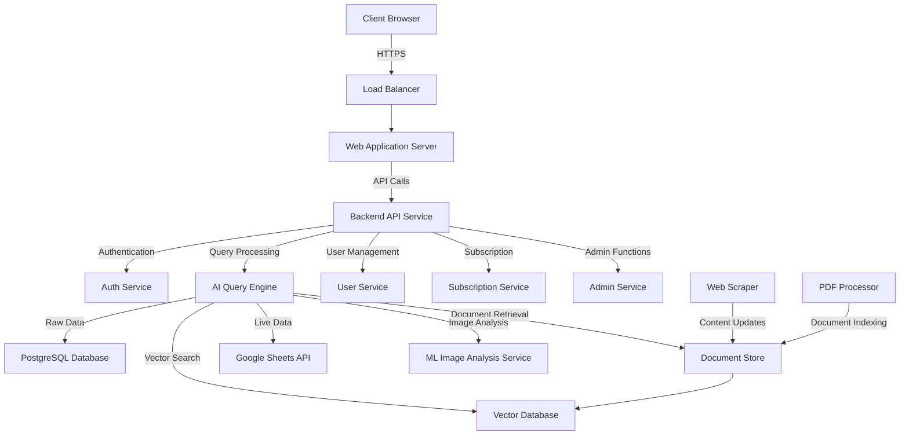
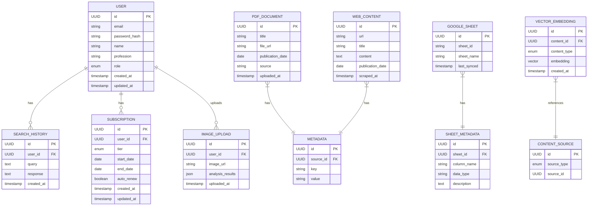
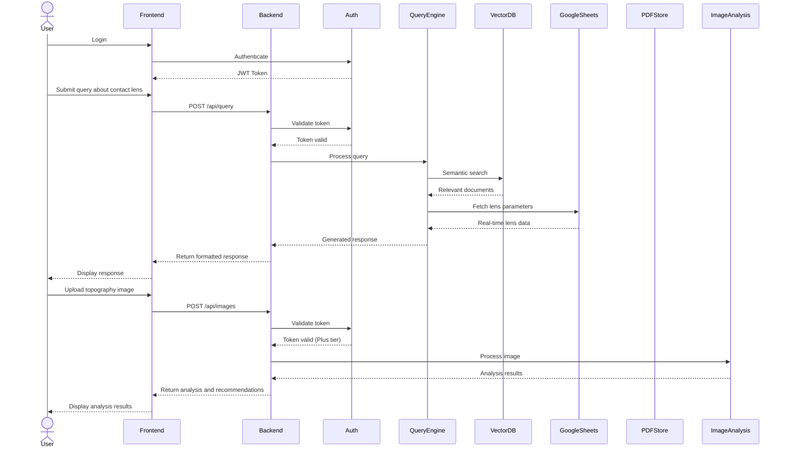
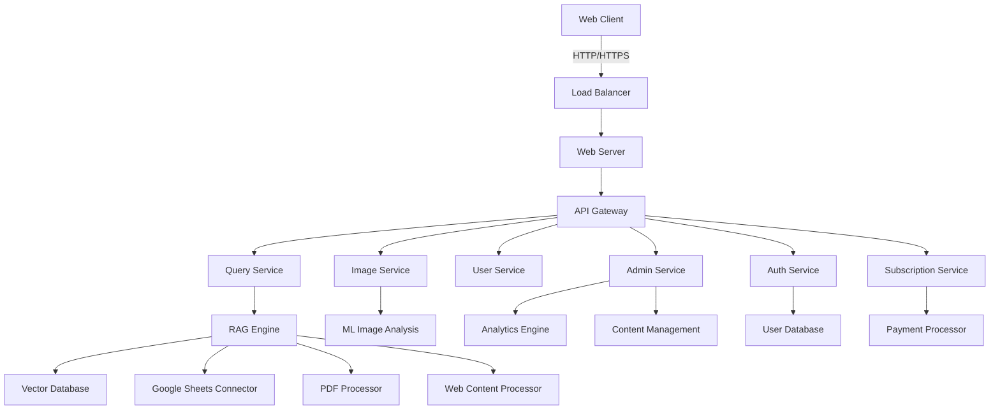
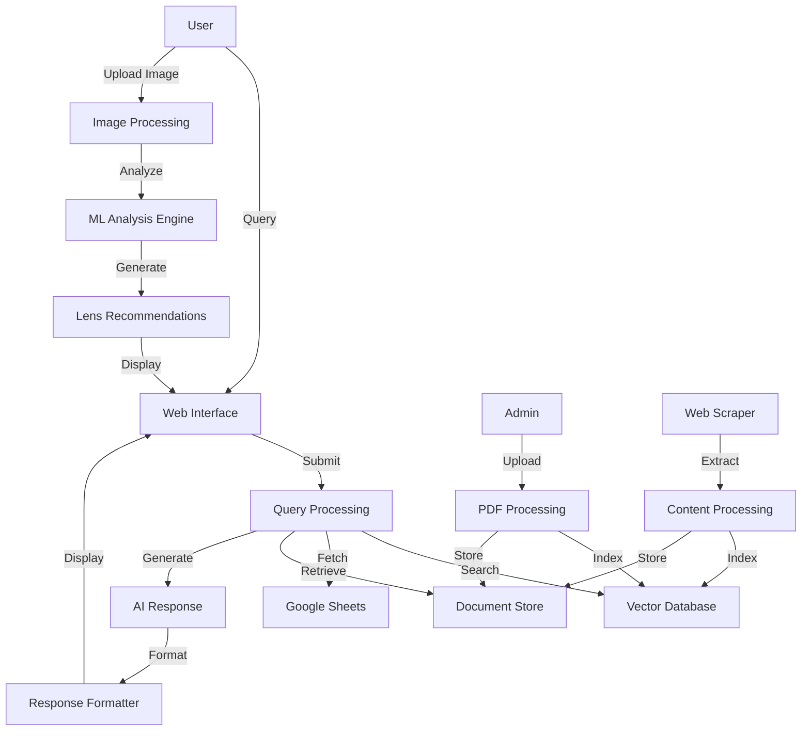

# Comprehensive Technical Implementation Plan: TheRightContact.com

## 1. Project Overview

### Purpose

TheRightContact.com is designed to be a highly specialized AI-powered contact lens information platform providing eye care professionals with immediate, accurate, and comprehensive answers to complex questions about contact lens parameters, product details, clinical studies, and historical data.

### Scope

- Web-based AI-powered platform with ChatGPT-like interface
- Integration with multiple data sources (Google Sheets, PDFs, web-scraped content)
- Retrieval-Augmented Generation (RAG) for conversational queries
- Image interpretation feature for corneal topography analysis
- Tiered subscription system (Free and Plus versions)
- User authentication and authorization system
- Admin dashboard for content management
- Comprehensive search and query functionality

### Stakeholders

- Product Owner: Dr. Jason Compton, responsible for defining requirements and priorities
- Development Team: Tron AI - Tahir Hameed, AI/ML specialists, database expert
- End Users: Eye care professionals (optometrists, ophthalmologists)
- Content Experts: Specialized optometrists providing domain expertise
- IT Operations: Responsible for deployment and maintenance

## 2. Requirements Analysis

### Functional Requirements

1. User authentication and role-based access control (Free vs. Plus users)
2. Natural language query processing for contact lens information
3. Integration with Google Sheets as primary data source for lens parameters
4. PDF document upload, indexing, and search functionality
5. Web scraping pipeline for relevant industry websites
6. Retrieval-Augmented Generation for multi-step, context-aware conversations
7. Image upload and analysis for corneal topography
8. Subscription management (Free vs. Plus tiers)
9. Admin dashboard for content management and user analytics
10. Dynamic response formatting (text, tables, images)
11. Search history for Plus users

### Non-Functional Requirements

1. Performance: Query responses delivered within 3 seconds for text, 5 seconds for image analysis
2. Scalability: Support up to 5,000 concurrent users
3. Security: HIPAA compliance for handling patient data, secure authentication
4. Usability: Intuitive interface requiring minimal training for eye care professionals
5. Availability: 99.9% uptime
6. Data accuracy: Continuous synchronization with Google Sheets for real-time data

### Technical Requirements

1. Frontend: Next.js framework
2. Backend: Python with FastAPI
3. Database: PostgreSQL for user data, Vector database for embeddings
4. AI/ML: Integration with OpenAI
5. Authentication: OAuth 2.0 with JWT
6. Cloud Platform: AWS (Amazon Web Services)
7. Version Control: Git with GitHub
8. CI/CD: GitHub Actions
9. Google Sheets API integration
10. PDF processing: PyPDF2 and LangChain for document processing
11. Image analysis: TensorFlow or PyTorch for corneal topography analysis
12. Web scraping: Scrapy or BeautifulSoup

## 3. System Architecture and Design

### High-Level Architecture

TheRightContact.com system follows a microservices architecture:

1. **Client**: Next.js single-page application with a ChatGPT-like interface
2. **Load Balancer**: Distributes traffic for high availability
3. **Web Application Server**: Next.js server for rendering and serving the frontend
4. **Backend API Service**: FastAPI service orchestrating all backend operations
5. **Auth Service**: Handles user authentication and authorization
6. **AI Query Engine**: Core component that processes natural language queries
7. **Vector Database**: Stores embeddings for semantic search
8. **PostgreSQL Database**: Stores user data, subscription info, and system configuration
9. **Document Store**: Manages PDF and web-scraped content
10. **Google Sheets API**: Integration for real-time lens parameter data
11. **ML Image Analysis Service**: Processes corneal topography images
12. **User Service**: Manages user profiles and preferences
13. **Subscription Service**: Handles subscription tiers and billing
14. **Admin Service**: Provides dashboard functionality for administrators
15. **Web Scraper**: Regularly updates content from industry websites
16. **PDF Processor**: Indexes uploaded PDF documents

### Component Design

1. **User Management Module**
   - Responsibilities: User registration, authentication, profile management
   - Interactions: Communicates with Auth Service and PostgreSQL Database

2. **Query Processing Module**
   - Responsibilities: Interprets natural language queries, determines data sources
   - Interactions: Communicates with AI Query Engine and Vector Database

3. **Data Integration Module**
   - Responsibilities: Integrates Google Sheets, PDF documents, web-scraped content
   - Interactions: Communicates with Google Sheets API, Document Store, and Vector Database

4. **RAG Conversation Module**
   - Responsibilities: Maintains context for multi-step conversations
   - Interactions: Stores conversation history, retrieves relevant context

5. **Image Analysis Module**
   - Responsibilities: Analyzes corneal topography images, provides recommendations
   - Interactions: Communicates with ML Image Analysis Service

6. **Subscription Management Module**
   - Responsibilities: Handles subscription tiers, billing, feature access
   - Interactions: Communicates with Subscription Service and PostgreSQL Database

7. **Admin Dashboard Module**
   - Responsibilities: Provides analytics, content management, user administration
   - Interactions: Communicates with Admin Service and PostgreSQL Database

8. **Response Formatting Module**
   - Responsibilities: Formats responses as text, tables, or images
   - Interactions: Communicates with AI Query Engine and client application

### Data Model

This data model represents the core entities in TheRightContact.com system:

- **User**: System users with different subscription tiers
- **Subscription**: User subscription information
- **Search_History**: Record of user queries and responses
- **Image_Upload**: Corneal topography images and analysis results
- **PDF_Document**: Uploaded PDF documents like clinical studies
- **Web_Content**: Content scraped from industry websites
- **Google_Sheet**: Information about connected Google Sheets
- **Metadata**: Metadata for PDF documents and web content
- **Sheet_Metadata**: Metadata for Google Sheets columns
- **Vector_Embedding**: Vector embeddings for semantic search
- **Content_Source**: Reference to the source of content

### Integration Design

1. **Google Sheets Integration**
   - Purpose: Access live contact lens parameter data
   - Integration Method: Google Sheets API with OAuth authentication
   - Data Flow: Regular polling for updates, caching for performance

2. **PDF Document Integration**
   - Purpose: Extract information from clinical studies and product manuals
   - Integration Method: PDF parsing libraries, embedding generation
   - Data Flow: Upload to S3, processing pipeline, vector database storage

3. **Web Scraping Integration**
   - Purpose: Gather up-to-date information from industry websites
   - Integration Method: Scheduled scraping jobs with content parsing
   - Data Flow: Scrape, clean, process, and store as searchable content

4. **OpenAI/LLM API Integration**
   - Purpose: Natural language processing and response generation
   - Integration Method: API integration with prompt engineering
   - Data Flow: User query → retrieved context → LLM prompt → formatted response

5. **Image Analysis Integration**
   - Purpose: Analyze corneal topography images
   - Integration Method: Custom ML model or third-party service
   - Data Flow: Image upload → preprocessing → ML analysis → recommendations

6. **Payment Gateway Integration**
   - Purpose: Handle subscription payments
   - Integration Method: Stripe or equivalent payment processor
   - Data Flow: User selection → payment processing → subscription activation

### Sequence Diagram

### Data Ingestion and ETL Processes

To ensure accurate and up-to-date information, TheRightContact.com requires robust data ingestion processes:

1. **Google Sheets Synchronization**:
   - Implement bidirectional sync with Google Sheets API
   - Store column metadata for proper interpretation
   - Schedule regular updates (every 15 minutes)
   - Implement change detection to minimize API calls

2. **PDF Document Processing**:
   - Upload interface for administrators
   - Extract text and structure using PyPDF2
   - Generate embeddings for semantic search
   - Extract and store metadata (publication date, source, etc.)
   - Implement priority scoring based on recency

3. **Web Scraping Pipeline**:
   - Identify authoritative industry websites
   - Schedule regular scraping jobs
   - Implement content extraction and cleaning
   - Generate embeddings for semantic search
   - Store metadata with source attribution

4. **Image Processing Pipeline**:
   - Accept various image formats for topography
   - Implement preprocessing for standardization
   - Extract features for ML analysis
   - Store processed images and analysis results

### Component Diagram

### Data Flow Diagram

## 4. Implementation Strategy

### Development Methodology

We will use an Agile Scrum methodology with two-week sprints. This approach allows for iterative development, frequent stakeholder feedback, and flexibility to adapt to changing requirements.

### Milestones and Timeline

**Phase 1: Foundation (Months 1-1.5)**
- Sprint 1 (2 weeks): User authentication and basic frontend
- Sprint 2 (2 weeks): Google Sheets integration and basic query processing
- Sprint 3 (2 weeks): Vector database setup and initial RAG implementation
- Sprint 4 (2 weeks): Basic admin dashboard and content management

**Phase 2: Core Functionality (Months 2-3)**
- Sprint 5 (2 weeks): Web scraping implementation
- Sprint 6 (2 weeks): Enhanced RAG with multi-step conversations
- Sprint 7 (2 weeks): Response formatting (text, tables, images)

**Phase 3: Advanced Features (Months 4)**
- Sprint 8 (1 weeks): Subscription management system
- Sprint 9 (1 weeks): Image upload and basic analysis
- Sprint 10 (1 weeks): Advanced ML for corneal topography
- Sprint 11 (1 weeks): Lens recommendation engine

**Phase 4: Refinement and Launch (Month 5)**
- Sprint 12 (1 weeks): Performance optimization and security hardening
- Sprint 13 (1 weeks): User acceptance testing and bug fixes

## 5. Development Environment Setup

### Tools and Technologies

- Frontend: Next.js, Next.js, Tailwind CSS
- Backend: Python 3.9+, FastAPI
- Databases: PostgreSQL, Pinecone or Weaviate (vector database)
- AI/ML: OpenAI API, TensorFlow/PyTorch
- Cloud: AWS (EC2, RDS, S3, Lambda)
- DevOps: Docker, GitHub Actions
- Monitoring: Prometheus, Grafana
- Authentication: Auth0 or AWS Cognito
- PDF Processing: PyPDF2, LangChain
- Web Scraping: Scrapy or BeautifulSoup
- Google Sheets: Google API Client Library

### Version Control Strategy

We will use Git with GitHub for version control with the following branching strategy:
- `main`: Production-ready code
- `staging`: Integration branch for testing
- `develop`: Integration branch for features
- `feature/*`: Individual feature branches
- `bugfix/*`: Bug fix branches
- `hotfix/*`: Emergency fixes for production

### Development Environment Setup

1. Clone the repository: `git clone [repository-url]`
2. Install Docker and Docker Compose
3. Run `docker-compose up` to start local development environment
4. Configure environment variables for:
   - Database connections
   - API keys (OpenAI, Google Sheets, etc.)
   - AWS credentials
   - Authentication settings
5. Run the application: `npm run dev` for frontend, `uvicorn main:app --reload` for backend

## 6. Testing and Quality Assurance

### Testing Strategy

1. **Unit Testing**:
   - Frontend: Jest and React Testing Library
   - Backend: Pytest for Python components

2. **Integration Testing**:
   - API integration tests with Postman/Newman
   - Database integration tests

3. **End-to-End Testing**:
   - Playwright or Cypress for frontend E2E tests
   - Automated user journey testing

4. **AI/ML Testing**:
   - Query result validation against known answers
   - Image analysis accuracy testing

5. **Performance Testing**:
   - Load testing with Locust or JMeter
   - Response time monitoring

6. **Security Testing**:
   - OWASP ZAP for vulnerability scanning
   - Regular security audits

### Test Environment Setup

1. Set up dedicated test databases and services
2. Implement test data generation scripts
3. Configure CI/CD pipeline for automated testing

### Test Case Development

1. Develop test cases for all user journeys
2. Create specialized tests for AI query accuracy
3. Implement performance benchmarks
4. Design security test scenarios

### Bug Tracking

GitHub Issues will be used for bug tracking with the following process:
1. Issues are created with detailed reproduction steps
2. Issues are triaged and prioritized weekly
3. Critical bugs are addressed immediately
4. Regular bug fix sessions are scheduled during sprints

## 7. Deployment Plan

### Infrastructure Setup

1. **AWS Environment Configuration**:
   - VPC and security groups
   - EC2 instances or ECS clusters
   - RDS for PostgreSQL
   - Vector database service
   - S3 for document storage
   - CloudFront for content delivery

2. **Containerization**:
   - Dockerize all application components
   - Implement Docker Compose for local development
   - Configure Kubernetes for production deployment

3. **CI/CD Pipeline**:
   - Set up GitHub Actions workflows
   - Implement automatic testing
   - Configure staging deployment
   - Set up production deployment with approval

### Deployment Strategy

We will implement a blue-green deployment strategy:
1. Deploy to staging environment
2. Run automated tests
3. Deploy to inactive production environment
4. Switch traffic when validated

### Monitoring and Logging

1. Set up centralized logging with ELK stack
2. Implement Prometheus for metrics collection
3. Configure Grafana dashboards for visualization
4. Set up alerts for critical issues
5. Implement distributed tracing with Jaeger

### Rollback Plan

1. Maintain versioned infrastructure as code
2. Implement automated rollback in CI/CD pipeline
3. Regularly test rollback procedures
4. Document manual rollback steps for emergencies

## 8. Security Considerations

### Data Protection

1. Implement encryption for all data in transit (HTTPS)
2. Configure encryption at rest for databases and storage
3. Implement proper key management
4. Regular security audits and penetration testing

### Authentication and Authorization

1. Implement OAuth 2.0 with JWT
2. Role-based access control (RBAC)
3. Secure password policies
4. MFA for administrative access

### Privacy Compliance

1. HIPAA compliance for patient data
2. GDPR compliance for European users
3. Privacy policy and terms of service
4. Data anonymization for image analysis

### Security Monitoring

1. Set up AWS GuardDuty
2. Implement WAF (Web Application Firewall)
3. Regular security scans
4. Vulnerability management process

## 9. Maintenance and Support

### Support Structure

1. Implement tiered support system:
   - L1: Basic user issues
   - L2: Technical issues
   - L3: Critical system issues

2. Set up support channels:
   - Email support
   - In-app chat
   - Knowledge base
   - FAQ section

3. Establish SLAs for different issue types:
   - Critical: 4 hours
   - High: 8 hours
   - Medium: 24 hours
   - Low: 48 hours

### Update Management

1. Schedule regular maintenance windows
2. Plan quarterly feature updates
3. Implement monthly security patches
4. Configure automatic database backups

### Monitoring and Alerting

1. Set up proactive monitoring for:
   - System health
   - API response times
   - Error rates
   - Data synchronization status
   - User activity

2. Configure alerts for:
   - System outages
   - Performance degradation
   - Security incidents
   - Data sync failures

### Knowledge Management

1. Maintain up-to-date documentation
2. Implement internal wiki for team knowledge
3. Create training materials for new team members
4. Document all processes and procedures

## 10. Documentation

### User Documentation

1. Create comprehensive user guides:
   - Getting started guide
   - Query formulation best practices
   - Image upload guidelines
   - Subscription management

2. Develop video tutorials:
   - Basic query demonstration
   - Advanced RAG conversation examples
   - Image analysis walkthrough

3. Implement in-app guidance:
   - Tooltips for features
   - Example queries
   - Interactive onboarding

### Technical Documentation

1. Maintain API documentation with Swagger/OpenAPI
2. Document system architecture
3. Create detailed component documentation
4. Maintain database schema documentation

### Admin Documentation

1. Create admin panel user guide
2. Document content management procedures
3. Develop troubleshooting guides
4. Create data management best practices

## 11. Risks and Mitigation Strategies

### Identified Risks

1. **Data Accuracy Risks**:
   - Risk: Outdated or incorrect contact lens information
   - Mitigation: Implement verification processes, regular data audits

2. **AI Performance Risks**:
   - Risk: Hallucinations or inaccurate responses
   - Mitigation: Implement fact-checking, citation, confidence scoring

3. **Integration Risks**:
   - Risk: Google Sheets API rate limiting or changes
   - Mitigation: Implement caching, monitoring, fallback mechanisms

4. **Performance Risks**:
   - Risk: Slow response times during peak usage
   - Mitigation: Implement caching, optimization, auto-scaling

5. **Security Risks**:
   - Risk: Data breaches or unauthorized access
   - Mitigation: Regular security audits, proper authentication

### Contingency Plans

1. Develop offline mode for critical data
2. Implement backup data sources
3. Create disaster recovery procedures
4. Plan for alternative AI providers if needed

## 12. Success Metrics and KPIs

### User Engagement Metrics

1. Daily active users (DAU)
2. Average session duration
3. Query volume per user
4. Feature utilization rates

### Performance Metrics

1. Average query response time
2. System uptime percentage
3. Error rate percentage
4. Image analysis accuracy

### Business Metrics

1. Conversion rate (Free to Plus)
2. Subscription renewal rate
3. Revenue per user
4. User growth rate

### Quality Metrics

1. Response accuracy score
2. User satisfaction rating
3. Support ticket volume
4. Bug frequency

## 13. Conclusion

TheRightContact.com implementation plan provides a comprehensive roadmap for developing a specialized AI-powered platform for eye care professionals. By following this plan, we will create a system that delivers accurate, timely information about contact lenses while providing advanced features like RAG conversations and image analysis.

The phased implementation approach allows for incremental development and testing, ensuring that each component is properly integrated and validated. With careful attention to data quality, user experience, and system performance, TheRightContact.com will become an invaluable tool for optometrists and ophthalmologists seeking reliable contact lens information.
